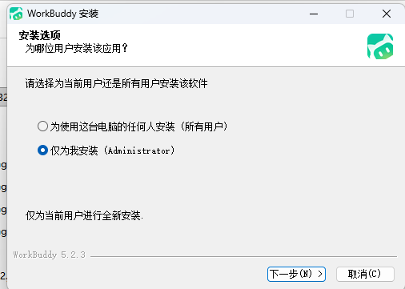
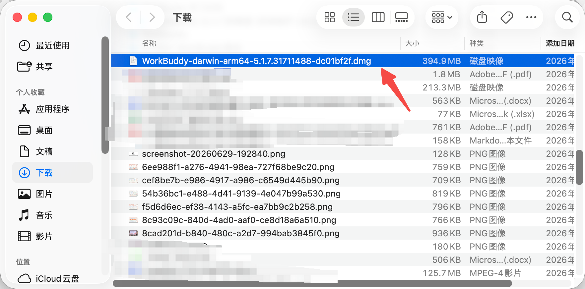

# 第 2 章 下载、安装、登录与更新

> 本章综合蓝皮书第 2 章与橙皮书「安装前准备」「客户端安装」「首次启动与登录」等内容。

## WorkBuddy 下载

下载 WorkBuddy，访问官网地址（https://www.codebuddy.cn/work/），选择 WorkBuddy，点击"下载 WorkBuddy"即可下载。

网站会自动检查你当前设备，判断你是什么版本——Mac ARM64、Mac x64 或者 Windows x64。

***切记：从官方入口进入下载，不从网盘或不明镜像获取安装包。***

## 安装前准备

### 系统要求

| 系统 | 最低版本 | 其他要求 |
|---|---|---|
| **macOS** | 12.0+ | Apple 芯片或 Intel，约 200MB 磁盘空间 |
| **Windows** | 10+ | .NET 运行时（精简版 Windows 需手动安装），约 200MB |
| **Linux** | 主流发行版 | 见官方文档 |

### 账号准备

- WorkBuddy 账号（微信 / 企业微信 / QQ 登录）
- 新用户首次登录赠送 **5000 Credits** 免费额度
- 每日签到可额外领取积分

> ⚠️ **重要**：建议登录后第一时间修改**默认工作空间存储路径**。默认路径在 C 盘，长期使用会导致 C 盘空间不足。修改路径：点击头像 → 设置 → 系统设置 → 修改工作空间存储路径。

## Windows 安装步骤

1. 访问官网下载 Windows 安装包（约 150-180MB）
2. 找到下载的 `WorkBuddySetup.exe`，**右键 → 以管理员身份运行**（这是插件正常安装的关键）
3. 建议使用默认安装路径（`C:\Program Files\Tencent\WorkBuddy`），避免中文路径引发兼容性问题
4. 安装完成后桌面自动生成快捷方式

**📸 Windows 安装截图**

## macOS 安装步骤

1. 访问官网下载 macOS 安装包（`.dmg` 文件）
2. 双击 `.dmg` 文件，将 WorkBuddy 图标拖入"应用程序"文件夹
3. 若提示"无法打开，因为 Apple 无法检查其是否包含恶意软件"：
   - 前往「系统设置 → 隐私与安全」
   - 在"安全性"栏点击「仍要打开」
4. 完成系统授权后重新打开即可

**📸 macOS 安装截图**

## 首次启动与登录

1. 双击打开客户端，进入登录界面
2. 使用微信 / 企业微信 / QQ **扫码登录**（无需手动输入账号密码）
3. 首次登录后，系统自动发放新手权益（5000 Credits + 10 款常用技能包，有效期 30 天）

**📸 登录界面**

*PS：若公司电脑禁止安装软件，不要绕过终端安全策略，应联系 IT 管理员确认白名单或企业部署方式。*

## 更新

点击左下角个人中心，选择"检查更新"，检查是否有新版本，若有新版本，可更新

**📸 更新界面**

## 常见问题

### 安装包打不开或提示损坏

先删除安装包并从官网重新下载，核对系统和芯片版本。仍失败时记录系统版本、安装包名和报错截图，通过官方反馈渠道处理，不要随意关闭系统安全功能。

### 登录后没有反应

检查默认浏览器是否拦截登录回跳、网络代理是否影响认证、系统时间是否准确。退出应用后重试，并保留日志与截图。

### 无法读取或写入文件

确认任务选择的工作目录是否正确、系统是否授予对应目录权限、文件是否被其他程序锁定。先用一个空白文本文件测试，不要直接拿重要文件反复试错。

### 更新前要不要备份

应用更新一般不应修改工作文件，但长期项目仍应把输入、产物、配置和自定义 Skill 纳入版本管理或定期备份。

---

*（你可以在本章后面插入 `` 来添加你自己的截图。）*
