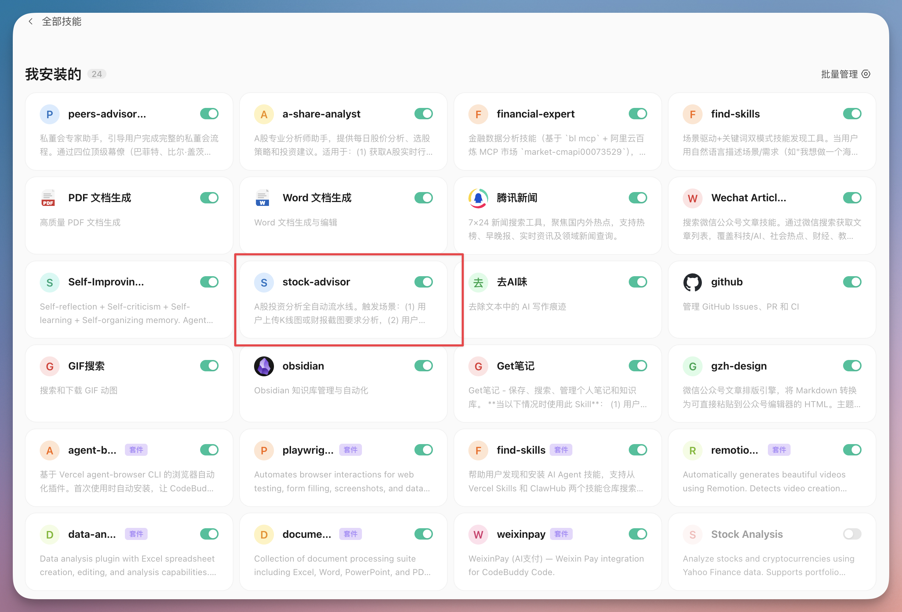
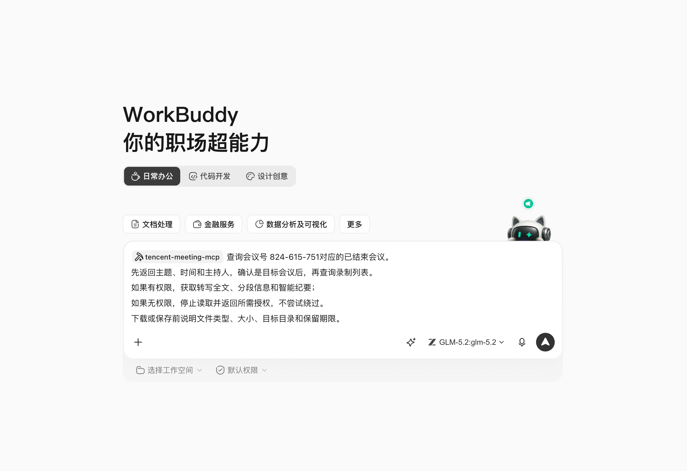

# 第 3 章 主界面、任务与工作区

> 本章综合蓝皮书第 3 章与橙皮书「界面布局全解析」「权限模式配置」「模型选择」「工作空间设置」等内容。

## 界面布局全解析

WorkBuddy 采用经典的三栏布局，和大多数桌面 AI 工作台一致，学会一个，其他基本都会。

```
┌────────────┬──────────────────────────────┬─────────────┐
│            │                            │             │
│  左侧导航栏  │       主对话区                │   结果面板    │
│            │                            │             │
│  · 新建任务 │   任务标题栏              │  · Artifacts │
│  · 技能    │   消息列表               │  · 所有文件  │
│  · 专家    │   输入区                │  · 变更预览  │
│  · 连接器   │                            │  · 文件预览  │
│  · 自动化   │                            │             │
│  · 资料库   │                            │             │
│  · 头像设置 │                            │             │
└────────────┴──────────────────────────────┴─────────────┘
```

**📸 WorkBuddy 主界面**（三栏布局：左侧导航 + 中间对话区 + 右侧结果面板）



### 左侧导航栏

| 入口 | 功能 |
|---|---|
| **新建任务** | 创建新对话 / 新任务 |
| **技能** | 进入 SkillHub，管理已安装和推荐的技能 |
| **专家** | 进入专家中心，召唤领域专家或专家团 |
| **连接器** | 管理 MCP 连接器（腾讯文档、QQ 邮箱等）|
| **自动化** | 管理定时自动化任务 |
| **资料库** | 管理知识库和外部文档来源 |
| **头像** | 进入个人设置（模型选择、权限管理、Claw 设置）|

### 主对话区

| 区域 | 功能 |
|---|---|
| **任务标题栏** | 显示当前任务名称，支持重命名 |
| **消息列表** | 显示 AI 思考过程、执行步骤、输出结果 |
| **输入区** | 输入自然语言指令，支持 `/技能名` 触发 Skill |

### 结果面板（右侧）

| 标签页 | 功能 |
|---|---|
| **Artifacts** | 显示 AI 生成的可交互内容（图表、网页、PPT）|
| **所有文件** | 本次任务生成和修改的所有文件列表 |
| **变更预览** | 显示文件的具体修改内容（diff 视图）|
| **文件预览** | 直接预览生成的文件内容 |

💡 结果面板可以通过标题栏的按钮切换显示/隐藏。

## 权限模式配置

权限模式决定了 AI **能碰什么、不能碰什么**，是 WorkBuddy 安全机制的核心。

### 三种权限模式

| 模式 | 权限等级 | 行为 | 典型场景 |
|---|---|---|---|
| **Ask** | 最低 | 只回答问题，完全不碰文件 | 咨询、概念解释、文案起草 |
| **Plan** | 中 | 先出执行计划，逐条确认后才执行 | 多步骤任务、文件处理 |
| **Craft** | 最高 | 直接操作文件、运行代码，每步仍需你确认 | 批量处理、写代码 |

### 如何切换模式

在**输入区上方**可以找到模式切换按钮，点击即可在 Ask / Plan / Craft 之间切换。

### 使用建议

**日常 90% 的任务用 Plan**：先计划后执行，全程可见，随时可以喊停。

**咨询讨论用 Ask**：不需要操作文件，省去不必要的确认步骤。

**批量文件处理和写代码用 Craft**：效率高，但需要盯紧每一步。

⚠️ **安全提示**：Craft 模式下 AI 可以直接修改文件，建议在处理重要文件前**手动备份**，并开启高危操作二次确认。

> 💡 **进阶技巧**：可以在记忆（Memory）中写入"任何项目开始时先思考，然后制定计划，最后才执行"的规则，让 Plan 模式成为默认行为。

**📸 权限模式切换**（输入区上方可切换 Ask / Plan / Craft 三种模式）



## 模型选择

### 配置路径

点击**左下角头像 → 设置 → 模型选项**，即可切换模型。

### 模型选择对照表

| 模型 | 优势场景 | 响应速度 | 中文能力 | 推荐场景 |
|---|---|---|---|---|
| **混元** | 日常办公、快速任务 | ⚡⚡⚡⚡⚡ | ★★★★★ | 日常办公（首选）|
| **DeepSeek** | 复杂推理、逻辑分析 | ⚡⚡⚡ | ★★★★☆ | 深度分析、代码推理 |
| **GLM** | 代码任务、技术文档 | ⚡⚡⚡ | ★★★★☆ | 代码生成、技术写作 |
| **Kimi** | 创意写作、长文本 | ⚡⚡⚡ | ★★★★★ | 公众号文章、长文创作 |
| **MiniMax** | 多模态、图像理解 | ⚡⚡⚡ | ★★★☆☆ | 图文混合任务 |

### 场景推荐

| 使用场景 | 推荐模型 | 理由 |
|---|---|---|
| 日常办公 | 混元 | 响应快、中文优化好、省积分 |
| 复杂推理 | DeepSeek | 推理能力强 |
| 代码任务 | GLM / Kimi | 代码理解能力突出 |
| 创意写作 | Kimi | 文本生成质量高 |
| 自动化定时任务（轻量）| 混元 / MiniMax | 省积分 |

💡 **省积分技巧**：轻量任务（消息提炼、格式转换）用轻量模型；重度任务（代码分析、长报告）用 reasoning 模型，但频率降低到 WEEKLY。

## 工作空间设置

### 修改默认存储路径

**默认路径在 C 盘，长期使用会爆满！** 务必修改：

1. 点击**左下角头像 → 设置**
2. 选择**系统设置**
3. 找到**工作空间存储路径**
4. 修改为非系统盘的路径（如 `D:\WorkBuddy-Workspace` 或 `/Users/xxx/WorkBuddy-Workspace`）

### 工作空间与自动化

创建自动化任务时，可以指定专属工作空间：
- 默认自动分配 `automation-claw-xxxx` 命名的工作空间
- 用于存放任务执行过程和结果文件，避免文件混乱
- 建议为不同自动化任务设置不同的工作目录

---

*（你可以在本章后面插入 `` 来添加你自己的截图。）*
