# 第 8 章 WorkBuddy 接入小程序与 IM 助理 ​

## 小程序的两种模式 ​

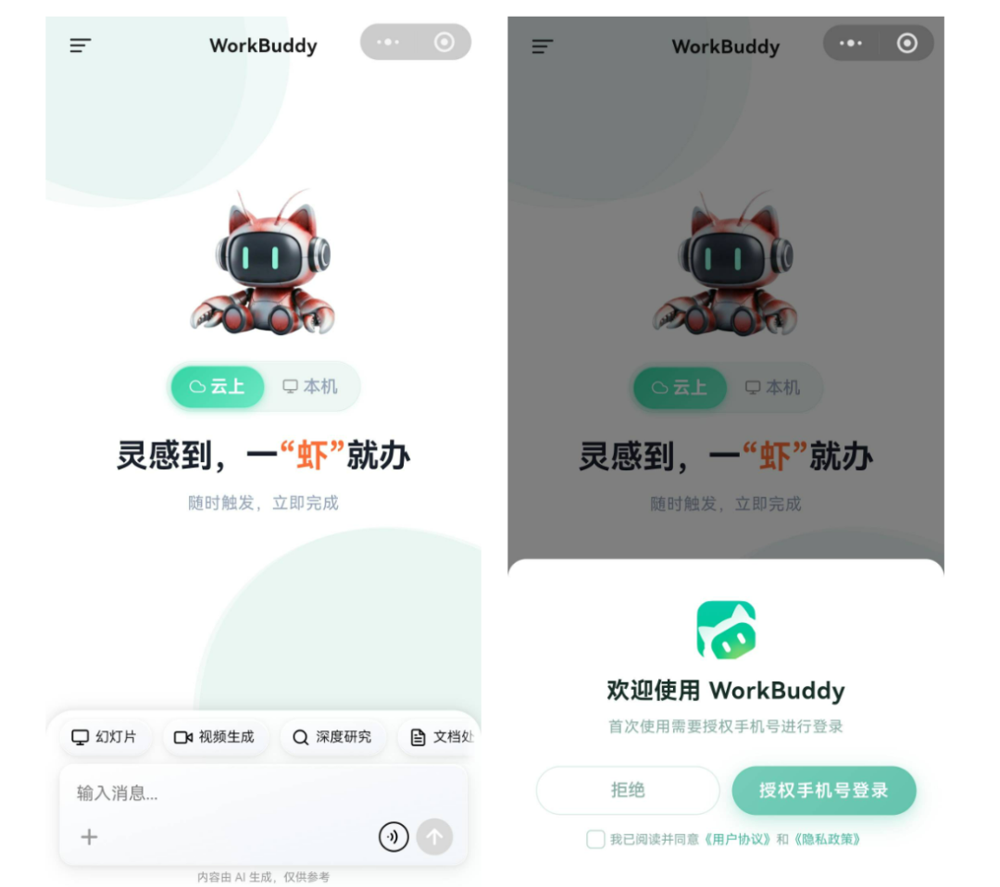

| 模式 | 任务在哪里运行 | 是否依赖电脑在线 | 适合任务 |
| --- | --- | --- | --- |
| 本机模式 | 已连接的电脑 | 是 | 本地文件、本地 Skill、已有工作区 |
| 云端模式 | 隔离的云端环境 | 否 | 调研、写作、临时分析、并行任务 |

**首次使用**

1. 通过官方入口打开 WorkBuddy 小程序并登录；
2. 查看当前处于本机还是云端模式；
3. 本机模式下确认目标电脑在线且连接正确；

## IM 助理的工作链路 ​

```
sequenceDiagram
    participant U as 手机 IM
    participant B as 应用机器人
    participant W as WorkBuddy 助理
    participant P as 本机工作区
    U->>B: 发送任务
    B->>W: 回调或长连接传递消息
    W->>P: 在授权目录执行
    P-->>W: 产物与状态
    W-->>B: 返回结果
    B-->>U: 手机查看与确认
```

## 接入微信助理：扫码绑定即可 ​

1. 打开 WorkBuddy，在左侧“助理”栏点击齿轮，进入“助理设置”；

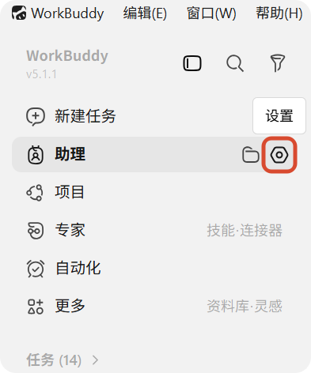

2. 找到“微信助理集成”，点击“配置”；

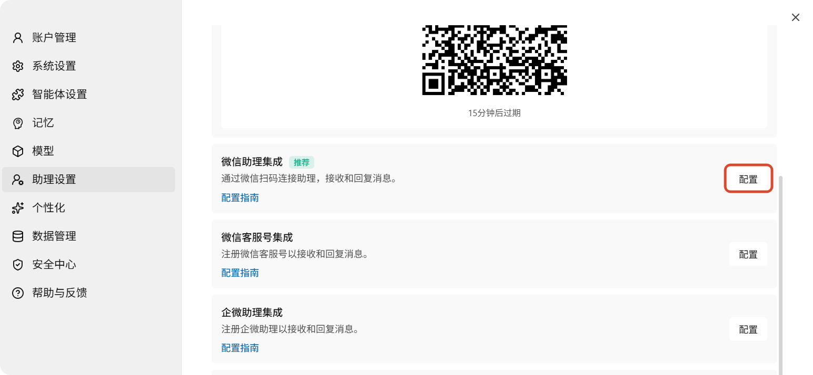

3. 等待绑定二维码生成，用手机微信扫码；

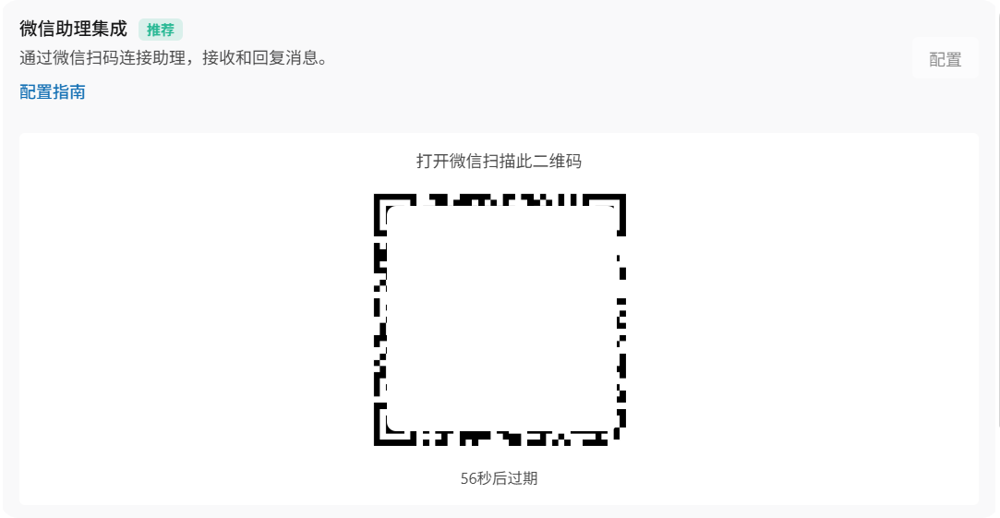

4. 卡片显示“已绑定”后，先发送一条只读测试指令；

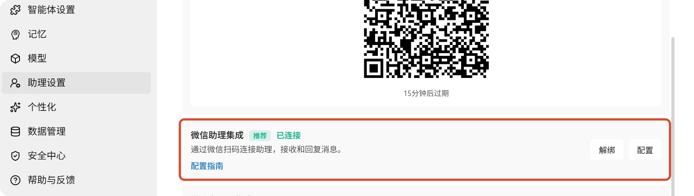

5. 需要切换微信账号时，先解绑当前账号，再重新扫码。

二维码有时效限制。停留在“绑定中”、二维码过期或扫码失败时，关闭配置窗口后重新进入，必要时重启 WorkBuddy 并重新生成二维码。

***来源：WorkBuddy 官方指南。***

## 接入飞书 ​

1. WorkBuddy → 设置 → 助理设置 → 选择飞书；


2. 在飞书开放平台创建企业自建应用；

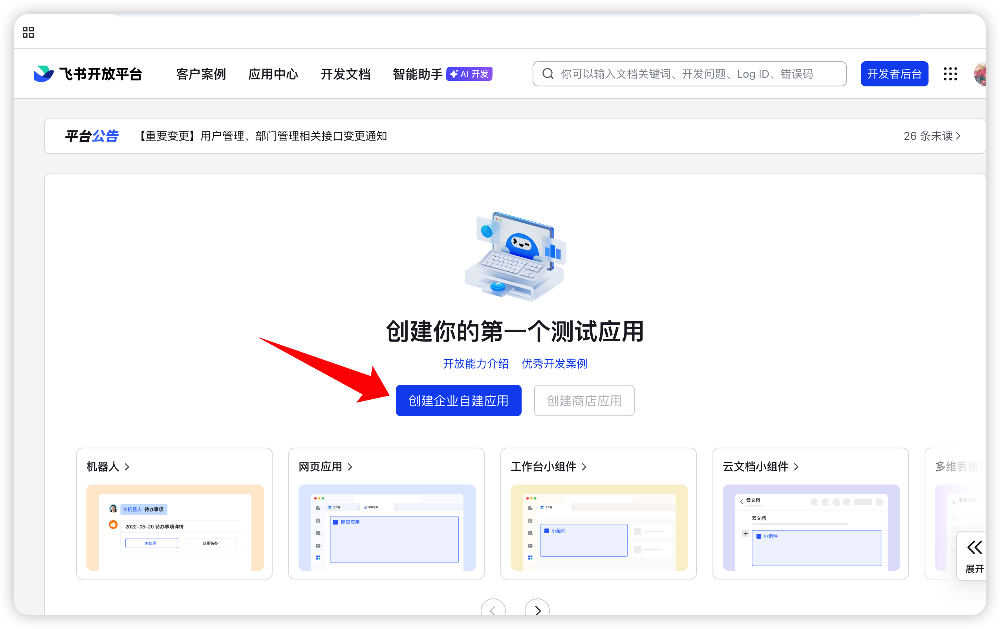

3. 为应用添加机器人能力；

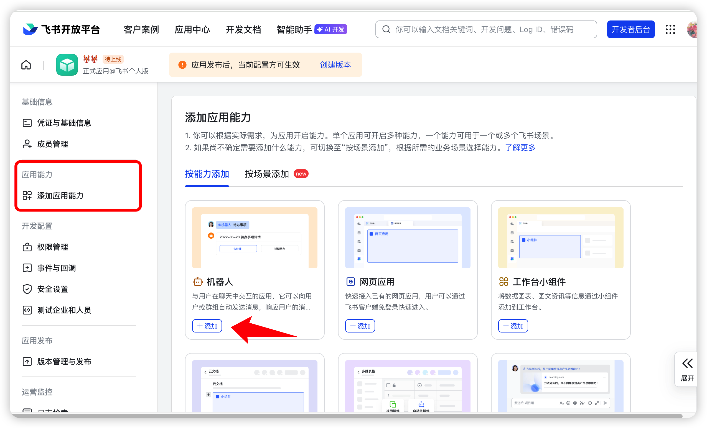

4. 按 WorkBuddy 当前页面要求开通最小权限；

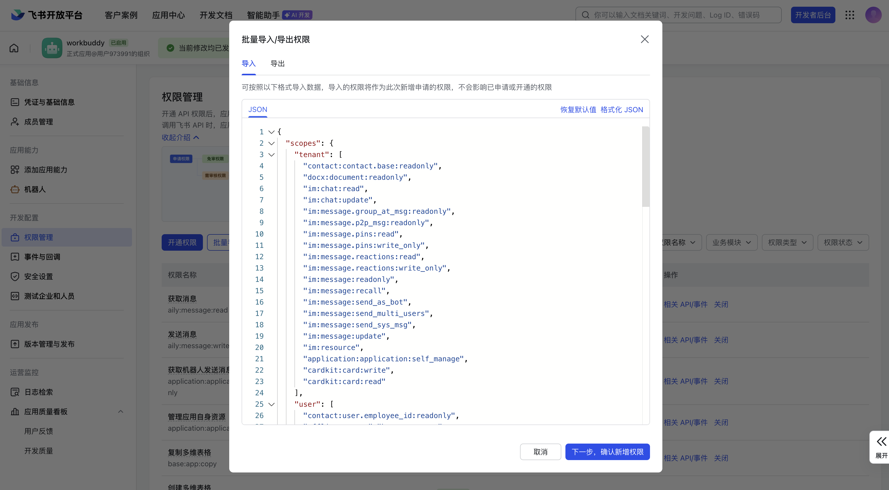

5. 在“凭证与基础信息”获取 App ID 和 App Secret；

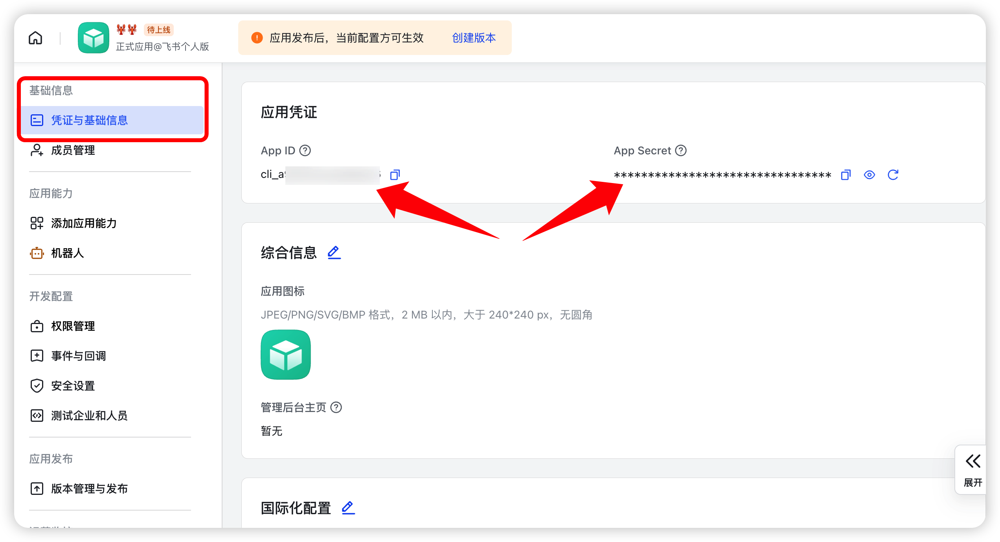

6. 将凭证填写到 WorkBuddy，生成或复制回调信息；

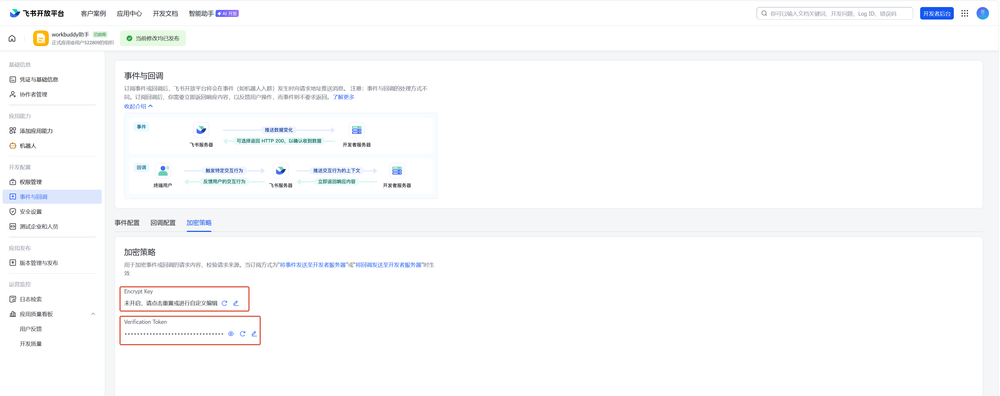

7. 在飞书配置事件订阅与回调；

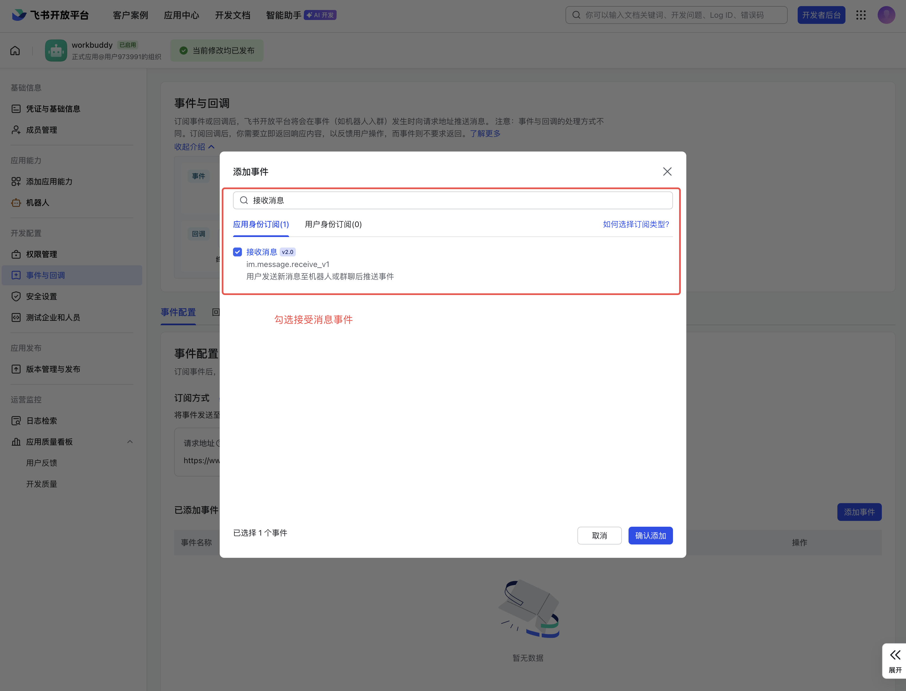

8. 添加接收消息、卡片交互等当前指南要求的事件；

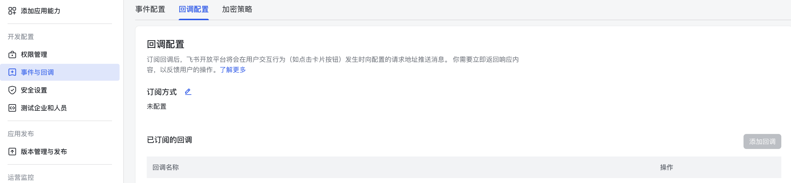

9. 创建版本并发布应用；

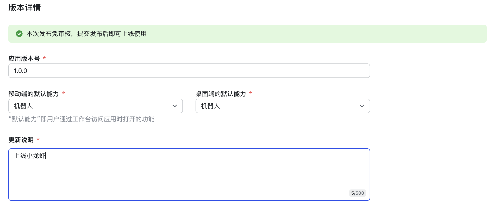

10. 在飞书内向机器人发送只读测试任务。

***来源：WorkBuddy 官方指南。***

## 接入钉钉 ​

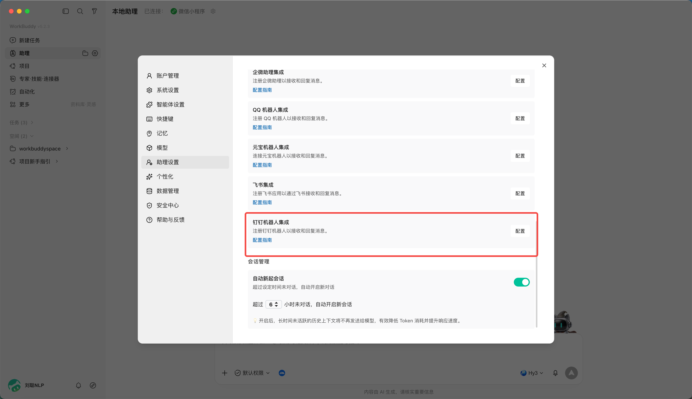

1. 创建应用与机器人使用企业管理员账号登录钉钉开发者后台；

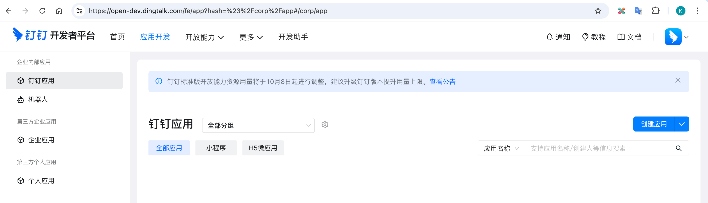

2. 进入“应用开发”，创建应用；

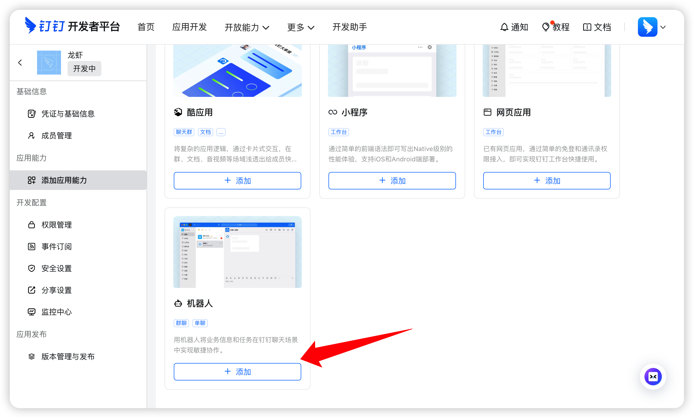

3. 为应用添加机器人能力，填写机器人名称、描述和头像并确认发布；

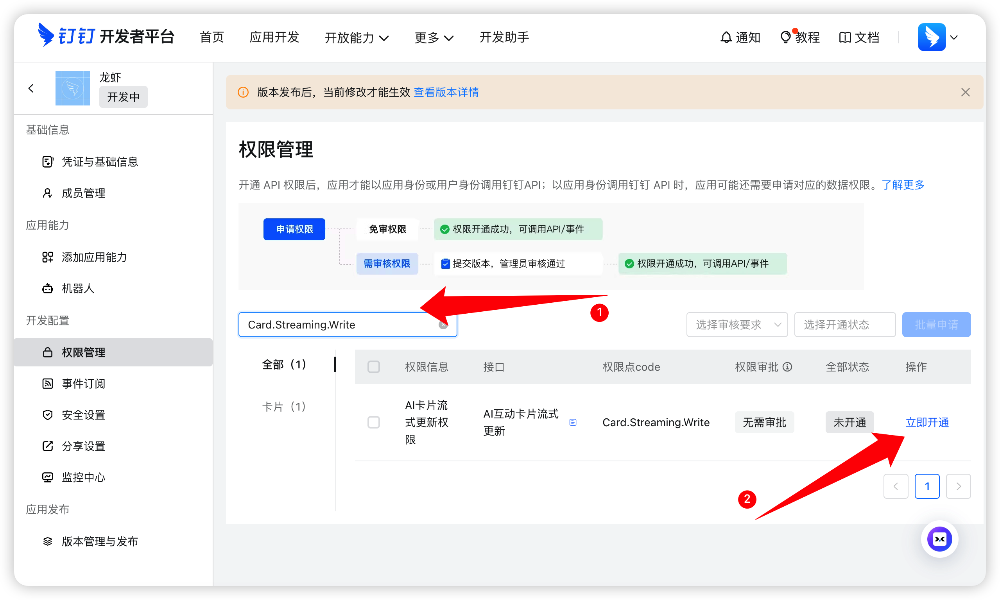

4. 优先在测试组织或测试群完成验证。

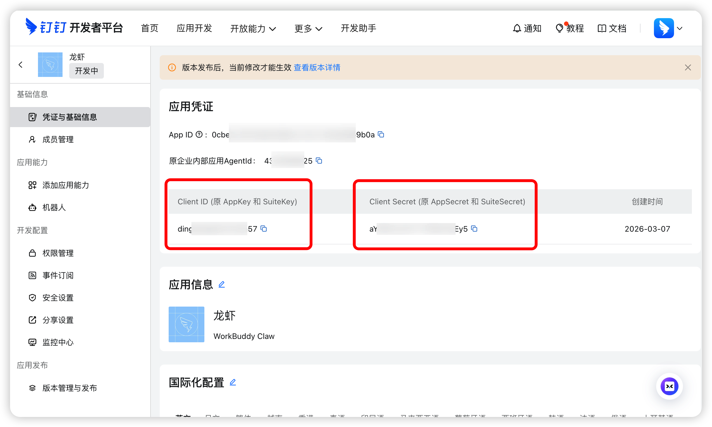

***来源：WorkBuddy 官方指南。***